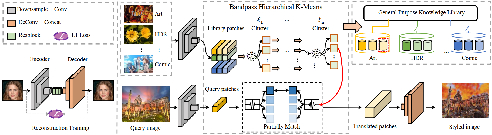

<!--
 * @FilePath: \undefinede:\StyleTransfer\Knowledge_Transfer\README.md
 * @Author: Ziang Liu
 * @Date: 2020-12-22 11:18:32
 * @LastEditors: Ziang Liu
 * @LastEditTime: 2020-12-22 11:33:27
 * @Copyright (C) 2020 SJTU. All rights reserved.
-->
# Image Translation via Fine-grained Knowledge Transfer
Xuanhong Chen, Ziang Liu, Ting Qiu, Bingbing Ni, Naiyuan Liu, Xiwei Hu, Yuhan Li

[[Project Website]](https://neuralchen.github.io/RainNet) [[Paper]](https://arxiv.org/abs/2012.11193)


## Abstract
Prevailing image-translation frameworks mostly seek to process images via the end-to-end style, which has achieved convincing results.
Nonetheless, these methods lack interpretability and are not scalable on different image-translation tasks (e.g., style transfer, HDR, etc.).
In this paper, we propose an interpretable knowledge-based image-translation framework, which realizes the image-translation through knowledge retrieval and transfer.
In details, the framework constructs a plug-and-play and model-agnostic general purpose knowledge library, remembering task-specific styles, tones, texture patterns, etc.
Furthermore, we present a fast ANN searching approach, Bandpass Hierarchical K-Means (BHKM), to cope with the difficulty of searching in the enormous knowledge library.
Extensive experiments well demonstrate the effectiveness and feasibility of our framework in different image-translation tasks.
In particular, backtracking experiments verify the interpretability of our method.

## Framework


## Results


## Citation
If you find this paper useful in your research, please consider citing:

```
@misc{chen2020image,
      title={Image Translation via Fine-grained Knowledge Transfer}, 
      author={Xuanhong Chen and Ziang Liu and Ting Qiu and Bingbing Ni and Naiyuan Liu and Xiwei Hu and Yuhan Li},
      year={2020},
      eprint={2012.11193},
      archivePrefix={arXiv},
      primaryClass={cs.CV}
}
```

## Contact
Please concat Ziang Liu(acemenethil@sjtu.edu.cn), Xuanhong Chen(xuanhongchenzju@outlook.com), Ting Qiu(776398420@sjtu.edu.cn) for questions about the details.

## Link
Learn about our other projects [[RainNet]](https://neuralchen.github.io/RainNe), [[Sketch Generation]](https://github.com/TZYSJTU/Sketch-Generation-with-Drawing-Process-Guided-by-Vector-Flow-and-Grayscale).